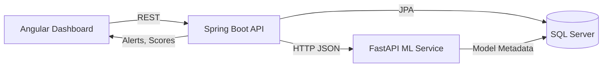

# Architecture

## System Overview

The platform uses a decoupled microservice approach:

- Angular frontend calls backend REST API.
- Backend persists entities in SQL Server and calls ML service for scoring.
- ML service exposes prediction and explanation endpoints.
- Alerting logic runs in backend and stores generated fraud alerts.

## Service Boundaries

- Backend (Spring Boot)
  - Transaction ingestion
  - Fraud scoring orchestration
  - Risk level mapping and alert creation
  - User/auth management and audit logging
- ML Service (FastAPI)
  - Model training, model versioning metadata
  - Real-time prediction endpoint
  - Explainability endpoint (SHAP/LIME)
- Database (SQL Server)
  - System of record for transactions, customers, devices, alerts, model versions
- Frontend (Angular)
  - Operational dashboard and analyst workflows

## Data Flow

1. Client submits transaction to backend.
2. Backend validates and stores transaction as RECEIVED.
3. Backend calls ML /predict with normalized payload.
4. ML service returns fraud probability and model version.
5. Backend maps probability to risk level and updates transaction record.
6. Backend creates alert when thresholds are met.
7. Frontend retrieves metrics and alerts from backend endpoints.

## Mermaid Diagram

## Initial Non-Functional Requirements

- Security: OAuth2/JWT for user and API access.
- Compliance: immutable audit logs for model and operator actions.
- Reliability: health checks and readiness probes per service.
- Observability: structured logs and metrics for API/ML latency.
- Scalability: stateless services, horizontal scaling in Kubernetes.

## Risk Mapping Policy (Initial)

- Low: probability < 0.40
- Medium: 0.40 <= probability < 0.75
- High: probability >= 0.75

These thresholds should be calibrated using validation data.
